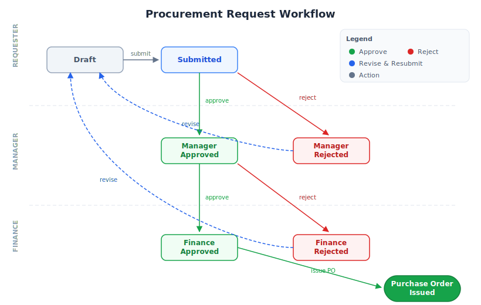

# RpFlo — ERP Procurement Request Workflow

## Project Overview

RpFlo is a small ERP-style procurement module for internal purchasing coordination. I selected a procurement request workflow rather than the sample billing flow: a requester raises a purchase request, managers review business need, finance reviews spend, and finance can issue a purchase order as the final business outcome.

## Quick Start

```bash
git clone https://github.com/NaserAnjum21/RpFlo.git
cd RpFlo
docker compose up --build
```

Open **http://localhost:3000** in your browser. No accounts or passwords needed — select a user from the dropdown in the top-right corner.

## Local Development Setup

Prerequisites: .NET 10 SDK, Node.js/npm, and Docker for SQL Server.

```bash
# Start only the database dependency
docker compose up db

# Run the API from a second terminal
dotnet run --project src/RpFlo.Api

# Run the frontend from a third terminal
cd frontend
npm ci
npm run dev
```

The API listens on **http://localhost:5000** and serves Swagger UI at **http://localhost:5000/swagger** in Development mode. The Vite dev server prints its local URL, usually **http://localhost:5173**, and proxies `/api` requests to the API. The local API uses the same SQL Server connection string as Docker Compose by default.

## Docker Notes and Troubleshooting

The Docker setup should work on Windows, macOS, Ubuntu, and other Linux distributions when Docker is running Linux containers. If it does not start cleanly, the issue is most likely one of these environment-specific cases:

- **Windows container mode:** Docker Desktop should be set to Linux container mode. The Dockerfiles use Linux base images and Linux package commands, so they will not run in Windows container mode.
- **Port already in use:** ports `3000`, `5000`, and `1433` need to be available, or the host-side port mappings in `docker-compose.yml` can be changed.
- **SQL Server container stays unhealthy:** this is usually caused by Docker not having enough memory available. Increasing Docker's memory allocation and retrying should resolve it.
- **Local database reset:** SQL Server data lives in the named Docker volume `mssqldata`. Use `docker compose down -v` only when you intentionally want to delete the local database data.
- **ARM machines:** .NET and frontend images are generally multi-platform, but the SQL Server container is the most likely compatibility edge case on Apple Silicon or ARM Linux. x64/amd64 Docker environments are the safest path.
- **Unexpected build context behavior:** `src/.dockerignore` and `frontend/.dockerignore` should keep build output and dependency folders out of the Docker context. If Docker appears to copy stale files, confirm those files are still present.

## Demo Users (Seeded)

| Name  | Role      | Department  | What they can do                          |
|-------|-----------|-------------|-------------------------------------------|
| Alice | Requester | Engineering | Create, submit, and revise requests       |
| Bob   | Requester | Marketing   | Create, submit, and revise requests       |
| Carol | Manager   | Operations  | Approve or reject submitted requests      |
| Dave  | Finance   | Finance     | Approve/reject and issue purchase orders  |
| Eve   | Admin     | Operations  | Full access to all operations             |

Switch users via the dropdown at any time — the UI adapts to show role-appropriate actions.

## Key User Flows



- **Requester** creates a draft with line items, then submits.
- **Manager** reviews and approves or rejects (with reason).
- **Finance** reviews and approves or rejects (with reason).
- **Finance** issues the purchase order (auto-generates PO number).
- On rejection, the **Requester** can revise and resubmit.
- **All users** can inspect their dashboard, filtered tasks, request detail, comments, notifications, and audit history according to their role.

## Features

- **Dashboard** — Metrics cards, status breakdown, department summary
- **Request list** — Server-paged views (All, My Requests, Drafts, Pending, Completed, Rejected)
- **Detail view** — Role-appropriate action buttons, line items table, audit trail timeline, comments
- **Notifications** — In-app notifications for workflow events with unread badge
- **CSV export** — Download visible procurement data
- **PDF export** — Download issued purchase orders
- **Audit trail** — Complete history of state transitions with timestamps and actors

## Architecture

### Clean Architecture (4 layers)

```
Domain ← Application ← Infrastructure
                      ← Api
```

- **Domain** — Entities, value objects, enums, domain events. Zero external dependencies.
- **Application** — DTOs, service orchestration, validators, repository interfaces.
- **Infrastructure** — EF Core, MSSQL, temporal tables, repository implementations, seed data.
- **Api** — Controllers, middleware, DI composition root.

### Key Design Decisions

**Clean Architecture** — Four layers with dependencies pointing inward: Api and Infrastructure depend on Application, which depends on Domain. Domain has zero external dependencies. This enforces separation of concerns — business rules in the domain are testable without frameworks, and infrastructure choices (database, web framework) can change without touching core logic.

**Strongly typed state machine** — `ProcurementRequest` enforces valid state transitions in the domain. Invalid transitions (e.g., approving a draft) return domain errors, not exceptions. The entity is the single source of truth for workflow rules.

**Value objects** — `Money` is immutable with currency, rounding, and arithmetic. Prevents primitive obsession and ensures monetary calculations are consistent.

**Domain events** — State transitions raise events (e.g., `ProcurementSubmitted`). Currently used for audit trail; the pattern supports future event handlers without modifying the domain.

**Simulated auth** — `X-User-Id` header with a role-switcher dropdown. Demonstrates access-control boundaries without the complexity of a real auth system. API reads, exports, and mutations are scoped by role or ownership; `/api/users` endpoints are the only unauthenticated API surface so the frontend can bootstrap the demo user switcher.

**Railway-oriented programming** — Domain and service operations return `Result<T>` (success or typed error) for expected business failures. Errors flow through the pipeline without exceptions, and controllers map error types to HTTP status codes (NotFound→404, Unauthorized→403, Validation→400).

### Tech Stack

| Layer    | Technology |
|----------|------------|
| Backend  | .NET 10, ASP.NET Core, EF Core (code-first) |
| Database | SQL Server 2022 |
| Validation | FluentValidation |
| API docs | Swashbuckle Swagger UI |
| Frontend | React 19, TypeScript, Vite, Tailwind CSS v4, Shadcn/ui (base-ui) |
| Data fetching | TanStack Query |
| Testing  | xUnit, FluentAssertions, FsCheck (property-based), TestContainers |
| Deploy   | Docker Compose |

## Data Model

```
User (id, name, email, role, department)
  │
  ├── ProcurementRequest (id, title, description, department, urgency, status, po_number, requester_id)
  │     ├── LineItem (id, name, quantity, unit_price, procurement_request_id)
  │     ├── AuditEntry (id, user_id, action, from_status, to_status, comment, procurement_request_id)
  │     └── Comment (id, user_id, text, procurement_request_id)
  │
  └── Notification (id, user_id, title, message, is_read, reference_id)
```

All entities inherit from `Entity` base class with `Id`, `CreatedAt`, `UpdatedAt`.

## API Endpoints

| Method | Path | Description |
|--------|------|-------------|
| GET | `/api/users` | List all users |
| GET | `/api/users/:id` | Get a demo user |
| GET | `/api/procurement` | List visible requests with server-side pagination/filtering |
| GET | `/api/procurement/my` | List the current requester's own requests |
| GET | `/api/procurement/pending` | List tasks pending for the current user role |
| GET | `/api/procurement/:id` | Get visible request detail |
| POST | `/api/procurement` | Create draft request |
| PUT | `/api/procurement/:id` | Update draft request |
| POST | `/api/procurement/:id/submit` | Submit for review |
| POST | `/api/procurement/:id/approve/manager` | Manager approval |
| POST | `/api/procurement/:id/reject/manager` | Manager rejection |
| POST | `/api/procurement/:id/approve/finance` | Finance approval |
| POST | `/api/procurement/:id/reject/finance` | Finance rejection |
| POST | `/api/procurement/:id/issue-po` | Issue purchase order |
| POST | `/api/procurement/:id/revise` | Revise rejected request |
| POST | `/api/procurement/:id/comments` | Add comment |
| POST | `/api/procurement/:id/line-items` | Add line items |
| DELETE | `/api/procurement/:id/line-items/:lineItemId` | Remove line item |
| GET | `/api/procurement/metrics` | Dashboard metrics |
| GET | `/api/notifications` | User notifications |
| GET | `/api/notifications/unread-count` | Unread count |
| POST | `/api/notifications/:id/read` | Mark notification read |
| POST | `/api/notifications/read-all` | Mark all read |
| GET | `/api/export/csv` | Export requests as CSV |
| GET | `/api/procurement/:id/export/pdf` | Export issued purchase order as PDF |

All API endpoints except the `/api/users` endpoints require `X-User-Id`. Approval, rejection, revision, line-item, comment, notification-read, list, detail, metrics, CSV export, and PDF export operations validate the caller's role or ownership.

## Testing

```bash
# All tests (requires Docker for integration tests)
dotnet test

# Domain tests only (fast, no dependencies)
dotnet test tests/RpFlo.Domain.Tests

# Application tests only
dotnet test tests/RpFlo.Application.Tests

# Integration tests (spins up real SQL Server via TestContainers)
dotnet test tests/RpFlo.Integration.Tests
```

### Test Coverage

| Suite | Tests | What's covered |
|-------|-------|----------------|
| Domain | 46 | State machine transitions, authorization, value objects, property-based (FsCheck) |
| Application | 35 | FluentValidation rules and service orchestration |
| Integration | 19 | Full API workflows through real HTTP + SQL Server |
| Frontend | 33 | Error boundary and role-specific detail behavior |
| **Total** | **133** | |

**Property-based tests** (FsCheck) verify invariants like Money commutativity, non-negative totals, and state machine properties across randomized inputs.

**Integration tests** use TestContainers to spin up a real SQL Server instance per test class, exercise the full HTTP pipeline through `WebApplicationFactory`, and verify multi-step workflows (create → submit → approve → issue PO), validation failures, and ownership checks.

## Tradeoffs & Assumptions

1. **No real authentication** — Simulated via header + dropdown. In production, this would use JWT/OAuth with proper middleware and policy-based authorization. The demo validates important ownership and role rules for mutating operations, but the header itself is not trusted security.

2. **Single aggregate** — `ProcurementRequest` is the sole aggregate root. For a real ERP, you'd split into bounded contexts (purchasing, inventory, budgeting). The current scope is intentionally focused.

3. **No file attachments** — Line items are data-only. A real procurement system would support document uploads (quotes, invoices). Omitted to keep scope manageable.

4. **Server-side list filtering, simple query model** — Lists, work queues, metrics, and exports are scoped server-side by user role. For demo scale this is implemented directly in repository queries rather than a separate read model or CQRS projection.

5. **Money is USD-only by default** — The `Money` value object supports currency but no exchange rates. Multi-currency would need a rate service.

6. **EF Core entity tracking** — New child entities (AuditEntry, Comment) added through domain operations are explicitly tracked in `UpdateAsync` to handle EF Core's Guid key detection behavior with DDD-style encapsulated collections.

7. **Static role model** — Roles are seeded as fixed demo users. The workflow demonstrates role-aware behavior, but there is no UI for administering users, departments, or permissions.

8. **Polling-based notifications** — Notification badge uses a 10-second `refetchInterval` via TanStack Query to simulate real-time updates. Simple and sufficient for demo scale; a production system would use WebSockets or Server-Sent Events.

9. **Optimistic concurrency** — `ProcurementRequest` uses a `RowVersion` concurrency token to prevent lost updates when multiple users act on the same request. The API returns 409 Conflict on stale writes. No client-side conflict resolution UI yet — the user sees an error and must retry.

## Known Limitations

- Authentication is simulated with a header and user switcher; appropriate for review, not production security.
- Authorization is role-based and coarse-grained — no configurable permission policies, approval thresholds, or delegated approvers.
- No conflict resolution UI for concurrent edits; optimistic concurrency catches conflicts server-side but the user must manually retry.
- Attachments, vendor records, budgets, inventory reservations, and real accounting integration are outside the current scope.
- Notifications are in-app only; email, Slack, and scheduled reminders are not implemented.
- Reporting/export surface is intentionally small: CSV for visible requests and PDF only after a purchase order is issued.
- SQL Server temporal history is captured at the persistence layer but not exposed in UI for browsing historical versions.

## What I Would Improve With More Time

### Product and Business

- Add configurable approval rules, such as amount thresholds, department-specific approvers, escalation paths, and dual approval for high-value purchases.
- Introduce role and user management UI so admins can assign departments, roles, approval limits, and temporary delegation without seed-data changes.
- Add richer procurement concepts: vendors, quotes, budget codes, attachments, invoice matching, and purchase order line-level fulfillment.
- Add business-facing notification rules for reminders, overdue approvals, and optional email/Slack delivery.

### Technical

- Harden security with real authentication, policy-based authorization, CSRF/CORS review, rate limits, and stricter permissions.
- Add observability for production readiness: structured logs, request correlation IDs, health checks with dependency detail, and metrics for cycle time and rejection reasons.
- Use xUnit collection fixtures to speed up integration tests by sharing a TestContainers SQL Server per suite, while carefully preserving isolation because the current tests assume independent setup.
- Add caching for read-heavy queries such as dashboard metrics and status breakdowns, with explicit invalidation after workflow mutations.
- Improve the `Result<T>` pattern and railway-oriented flow to reduce repetitive service/controller boilerplate while keeping error mapping explicit.
- Expand frontend test coverage for role-specific actions, loading/error states, exports, filters, and the full request lifecycle.
- Expose temporal table history through a version-diff UI so users/admins can compare past states of a request.
- Add real-time updates via SignalR so approvers see new submissions without page refresh.

## AI-Assisted Development

AI assistance was used as a coding and review partner for scaffolding, test ideation, edge-case review, documentation review, and targeted refactoring. I used general, global-level Codex and Claude skills for broad engineering guidance such as .NET testing, EF Core query optimization, and frontend best practices. These were not added as project-level skills because they are reusable best-practice aids rather than RpFlo-specific project knowledge.

I reviewed AI-assisted output before keeping it, especially domain-sensitive code such as workflow transitions, role checks, validation, result/error mapping, and persistence behavior. Verification included the backend test suite, integration tests through SQL Server/TestContainers, frontend tests/build checks where relevant, linting, and Docker Compose configuration review.

## Project Structure

```
├── src/
│   ├── RpFlo.Domain/        # Entities, value objects, enums, events
│   ├── RpFlo.Application/   # DTOs, services, validators, interfaces
│   ├── RpFlo.Infrastructure/ # EF Core, repositories, seed data
│   └── RpFlo.Api/           # Controllers, middleware, Program.cs
├── tests/
│   ├── RpFlo.Domain.Tests/
│   ├── RpFlo.Application.Tests/
│   └── RpFlo.Integration.Tests/
├── frontend/                          # React + TypeScript + Vite
├── docker-compose.yml
└── RpFlo.sln
```
